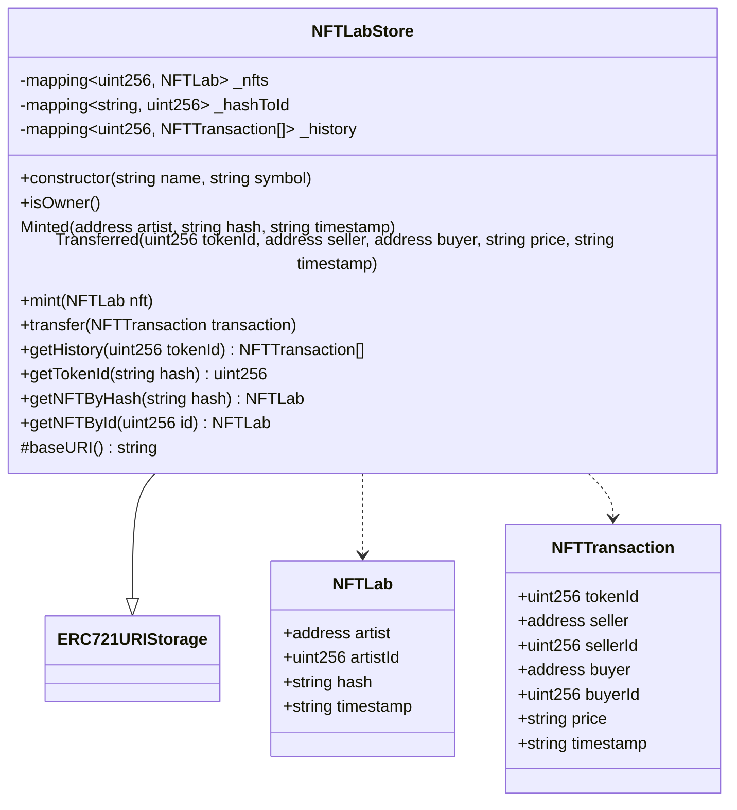

<script src="https://cdn.jsdelivr.net/npm/mermaid/dist/mermaid.min.js"></script>
<script>mermaid.initialize({startOnLoad:true});</script>
# NFTLab smart contract in Ethereum

[](https://coveralls.io/github/NFT-Lab/smart-contract-ethereum?branch=main)
[](https://github.com/NFT-Lab/smart-contract-ethereum/actions/workflows/build.yml)

La seguente repository contiene lo smart contract per Ethereum per la gestione della compra vendita di NFT nella piattaforma NFTLab.

[TOC]

## Strumenti utilizzati

- **[Node.js](https://nodejs.org/it/)**.
- **[NPM](https://www.npmjs.com/):** il package manager di default per la gestione di pacchetti con node.js.
- **[Typescript](https://www.typescriptlang.org/):** un superset di javascript il quale aggiunge la tipizzazione e molti altri costrutti. 
- **[Hardhat](https://hardhat.org/):** uno strumento semplice e veloce per la scrittura di smart contract, il quale automatizza la compilazione, il deploy e l'esecuzione dei test. Tutti gli script possono essere scritti utilizzando anche il linguaggio Typescript e, insieme ad un plugin chiamato typechain che viene integrato direttamente durante la compilazione, è possibile scrivere i test di uno smart contract a partire da un'interfaccia dello smart contract. Hardhat ha una grande comunity e molti plugin che permettono di svolgere qualsiasi operazione.
- **[Solhint.js](https://github.com/protofire/solhint):** linter per il linguaggio solidity.
- **[Solidity-coverage](https://github.com/sc-forks/solidity-coverage):** strumento per ottenere il code coverage di un contratto scritto in solidity.
- **[Coveralls](https://coveralls.io/github/NFT-Lab/smart-contract-ethereum?branch=main):** servizio che permette di avere il report del code coverage raggiunto.
- **[Mocha.js](https://mochajs.org/):** framework che facilita la scrittura di test in node.js.
- **[Chai.js](https://www.chaijs.com/):** libreria per la scrittura di asserzioni durante i test.

## Organizzazione della repository

```bas
├── contracts
│   ├── ERC721
│   │   ├── ERC721.sol
│   │   └── ERC721URIStorage.sol
│   └── NFTLabStore.sol
├── coverage.json
├── hardhat.config.ts
├── LICENSE
├── package.json
├── package-lock.json
├── README.md
├── scripts
│   └── deploy_NFTLabStore.ts
├── test
│   └── TestNFTLabStore.ts
└── tsconfig.json
```

### Contracts

La cartella **contracts** contiene tutti gli smart contract che sono stati scritti.

Lo smart contract principale si chiama **NFTLabStore.sol**, mentre i file dello standard ERC721 che hanno richiesto delle modifiche sono contenuti dentro la cartella **ERC721**.

#### ERC721

Dello standard è stato modificato solamente il sistema di approvazione, in modo tale da permettere all'owner di mettersi come persona autorizzata al trasferimento dei token.

#### NFTLabStore



##### Costruttori

- **constructor(string name, string symbol):** costruisce il contratto assegnando un nome ed un simbolo per il NFT.

##### Modificatori

* **isOwner:** permette l'esecuzione del metodo solamente al proprietario del contratto.

##### Eventi

* **Minted**: evento che segnala la creazione di un nuovo NFT.
* **Transferred**: evento che segnala il trasferimento di un NFT da un wallet ad un altro.

##### Strutture

* **NFTLab:** consiste in un NFT.
* **NFTTransaction:** consiste in una transazione di un NFT.

##### Metodi

* **mint(NFTLab memory nft):** permette la creazione di un nuovo NFT
  * **View:** false
  * **Modificatori:** 
    * isOwner
* **transfer(NFTTransaction memory transaction):** permette di trasferire un NFT da un wallet ad un altro
  * **View:** false
  * **Modificatori:** 
    * isOwner
* **getHistory(uint256 tokenId) NFTTransaction[]:** permette di ottenere la storia delle transazioni di un NFT a partire dal suo ID
  * **View:** true
  * **Modificatori:** 
    * isOwner
* **getTokenId(string memory hash) uint256:** permette di ottenere l'id di un NFT a partire dal suo hash
  * **View:** true
  * **Modificatori:** 
    * isOwner
* **getNFTByHash(string memory hash) NFTLab:** permette di ottenere un NFT a partire dal suo hash
  * **View:** true
  * **Modificatori:** 
    * isOwner
* **getNFTById(uint256 id) NFTLab:** permette di ottenere un NFT a partire dal suo id
  * **View:** true
  * **Modificatori:** 
    * isOwner

### Scripts

La cartella **scripts** contiene lo script per eseguire il deploy direttamente in Ethereum, attraverso i comandi dello strumento HardHat.

### Test

La cartella **test** contiene i test di unità per lo smart contract NFTLabStore. Tutti i test sono stati scritti utilizzando gli strumenti **mocha.js** e **chai.js**.

Per saperne di più consultare la documentazione di hardhat: [https://hardhat.org/tutorial/testing-contracts.html](https://hardhat.org/tutorial/testing-contracts.html)

## Comandi

I principali comandi da eseguire sono disponibili alla seguente pagina: [https://hardhat.org/getting-started/](https://hardhat.org/getting-started/).

Per comodità si consiglia l'installazione del tool [Shorthand and autocomplete](https://hardhat.org/guides/shorthand.html).

## Continuous Integration

### Build

Viene eseguita dalla action presente nel file **build.yml** ad ogni push nel **main** o nel **develop** e ha il compito di compilare, eseguire i test e inviare il report del code coverage a **coveralls**. 

### Check

Viene eseguita dalla action presente nel file **pull-request.yml** e ha il compito di controllare che quanto si vuole aggiungere al branch **main** o **develop**, in seguito ad una pull request, sia stato validato dal linter e che tutti i test vengano eseguiti correttamente.